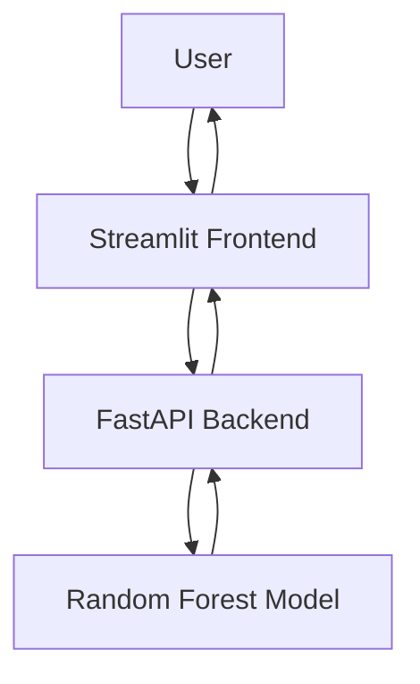

# 🌱 Crop Recommendation System

A production-inspired machine learning application that recommends the most suitable crop based on soil nutrients and environmental conditions.

The project combines machine learning, FastAPI, Streamlit, Docker, and Docker Compose to demonstrate an end-to-end ML deployment workflow.


## 🚀 Live Demo

Deployment will be added soon.

- Frontend: https://crop-recommendation-ahmad.streamlit.app/
- API: https://crop-recommendation-api-fzgg.onrender.com
- API Documentation: https://crop-recommendation-api-fzgg.onrender.com/docs


## 📖 Project Overview

Selecting the right crop is an important decision for maximizing agricultural productivity. This project uses a supervised machine learning model to recommend the most suitable crop based on soil and environmental characteristics.

The application follows a modular architecture where:

- A Random Forest model performs predictions.
- FastAPI exposes the model through a REST API.
- Streamlit provides an intuitive user interface.
- Docker and Docker Compose simplify deployment.


## ✨ Features

- Crop recommendation using Machine Learning
- REST API built with FastAPI
- Interactive frontend using Streamlit
- Dockerized application
- Docker Compose support
- Automated unit and API testing with Pytest
- Modular project structure
- Type hints, docstrings, and logging


## 🛠 Tech Stack

| Category | Technology |
|-----------|------------|
| Programming Language | Python 3.11 |
| Machine Learning | Scikit-learn |
| Backend | FastAPI |
| Frontend | Streamlit |
| Data Processing | Pandas, NumPy |
| Model Serialization | Joblib |
| Testing | Pytest |
| Containerization | Docker |
| Orchestration | Docker Compose |


## 🏗 Project Architecture




## 📂 Project Structure

```text
Crop Recommendation/
│
├── app/
│   ├── api.py
│   ├── config.py
│   ├── exception.py
│   ├── inference.py
│   ├── logger.py
│   ├── schemas.py
│   └── __init__.py
│
├── artifacts/
│   ├── random_forest_crop_model.joblib
│   ├── class_names.joblib
│   └── feature_names.joblib
│
├── frontend/
│   ├── app.py
│   ├── Dockerfile
│   └── requirements.txt
│
├── tests/
│   ├── test_api.py
│   └── test_inference.py
│
├── Dockerfile
├── compose.yaml
├── requirements.txt
└── README.md
```


### env variable is crop_rec